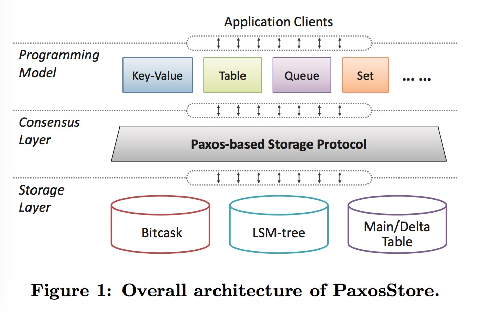

PaxosStore
===========

PaxosStore is a distributed-database inspired by Google MegaStore, it's the second generation of storage system developed to support current WeChat sevices and applications. 
PaxosStore has been deployed in WeChat production for more than two years, providing storage services for the core businesses of WeChat backend including user account management, user relationship management (i.e., contacts), instant messaging, social networking, and online payment. 

Now PaxosStore is running on thousands of machines, and is able to afford billions of peak TPS. 

Prior to PaxosStore, we have been using a QuorumKV storage system to support WeChat service with strongly consistent read/write since 2011. As the number of storage servers rises to tens of thousand, the operational mantenance and development of a NWR-based service in such large scale become painful. That's why we come up with PaxosStore: a new generation of distributed database, built top of the leaseless paxos consensus layers, providing
 - __Two paxos consensue libraries__(the key algorithms described in our paper published at the VLDB 2017 are now open source): 
   - **Certain** component for normal PaxosLog + DB design;
   - **Paxoskv** component for Key Value(PaxosLog-as-value);

   In addition, the following items ar planned for open source by October 2017.
 - __A high performance Key-Value system__
 - __A system that supports rich data structures such as queues and collections__ 
 - __A high performance storage engine based on LSM-tree__ 
 - __A New SQL-like Table system__
 

### PaxosStore Architecture

Please refer to the following publications for the technical details of PaxosStore.
- [VLDB 2017 PaxosStore: High-availability Storage Made Practical in WeChat](http://www.vldb.org/pvldb/vol10/p1730-lin.pdf)
- [微信PaxosStore：深入浅出Paxos算法协议](http://www.infoq.com/cn/articles/wechat-paxosstore-paxos-algorithm-protocol)  
- [微信PaxosStore内存篇：十亿Paxos/分钟的挑战](http://www.infoq.com/cn/articles/one-billion-paxos-minutes-of-challenge)
- [微信后台基于时间序的海量数据冷热分级架构设计实践](https://mp.weixin.qq.com/s/XlZF0GDt7dnHyYuS1an6tg)

### Build

- [Certain](./certain)
- [PaxosKV](./paxoskv)

### License

PaxosStore is under the BSD 3-Clause License. See the [LICENSE.txt](./LICENSE.txt) file for details.
